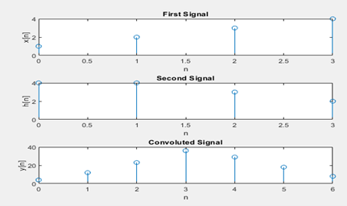
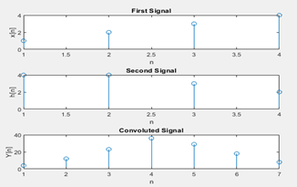

## Experiment No : 01

## Submission Date : May 03, 2022

## Experiment Name :

## Implementation of convolution using built in function and without built in function in MATLAB.

---

## Theory :

Convolution is a mathematical procedure used in signal processing that joins two functions to create a third function that describes how one of the original functions influences the other. An asterisk is often used to indicate the operation.

The general representation of convolution involves two functions, let's call them f and g, which can be continuous or discrete. The convolution of f and g, denoted as (f \* g), is given by:

(f \* g)(t) = ∫ f(τ) g(t-τ) dτ (for continuous functions) or

(f \* g)[n] = Σ f[k] g[n-k] (for discrete functions)

where t represents a continuous variable, n represents a discrete index, and τ and k are integration and summation variables, respectively.

The convolution of f and g, weighted by the values of f, conceptually depicts how the shape of one function (g) is altered when it is shifted across the other function (f). This results in a new function that describes the result of combining the two functions.

## Code :

Using Conv Function:

```matlab
x = [ 1 2 3 4];
h = [ 4 4 3 2];

subplot( 3, 1, 1);
t = 0 :length(x)-1;
stem( t, x);
xlabel('n');
ylabel('x[n]');
title('First Signal');

subplot( 3, 1, 2);
t = 0:length(h)-1;
stem( t, h);
xlabel('n');
ylabel('h[n]');
title('Second Signal');

y = conv( x, h);

subplot( 3, 1, 3);
t = 0 : length(y)-1;
stem( t, y);
xlabel('n');
ylabel('y[n]');
title('Convoluted Signal');
```

## Output:



**Fig.** : Convolution of two signals using conv function

Without using the conv function:

```matlab
x = [ 1 2 3 4];
h = [ 4 4 3 2];

m=length(x);
l=length(h);
X=[x,zeros(1,l)];
H=[h,zeros(1,m)];

z=[];
for i=1:m
    g=h.*x(i);
    z=[z;g];
end

[r c] = size(z);
k = r+c;
t =2;
Y =[];
cd =0;

while(t<=k)
    for i=1:r
        for j=1:c
            if((i+j)==t)
                cd = cd+ z(i,j);
            end
        end
    end
    t = t+1;
    Y = [Y cd];
    cd =0;
end


subplot(3,1,1); stem(x); xlabel('n');
ylabel('x[n]'); title('First Signal');

subplot(3,1,2); stem(h); xlabel('n');
ylabel('h[n]'); title('Second Signal');

subplot(3,1,3); stem(Y); xlabel('n');
ylabel('Y[n]'); title('Convoluted Signal');
```

## Output :



**Fig.:** Convolution of two signals without using conv function

## Discussion :

We compute the convolution of the same signals without utilizing the conv function after convolving two signals using the built-in conv function in MATLAB; both implementations produce the same result, as illustrated by the above images.
