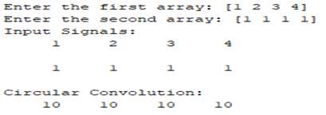
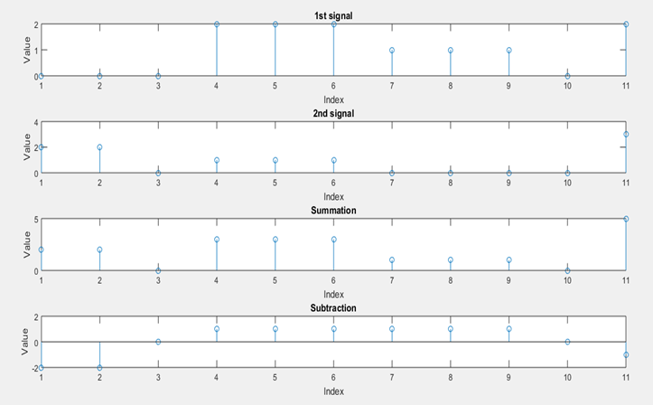
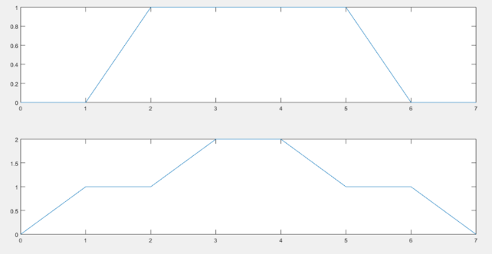

## Experiment No : 02

## Submission Date : May 08, 2023

## Experiment Name :

## Implementation of circular convolution, sum and subtract of two signals and draw two particular figures in MATLAB.

---

## Theory :

<p style="text-align: justify">
A procedure known as circular convolution combines two finite-length sequences by looping one sequence around the other and then conducting a convolution. The reason it is named "circular" is because the beginning and conclusion of each sequence are linked together to form a circle. Digital signal processing frequently employs circular convolution, particularly when implementing digital filters. It has some advantages over linear convolution in terms of computational simplicity and performance, and it can be used to determine how a linear time-invariant system responds to a periodic input signal.
</p>
<p style="text-align: justify">
The two sequences are first padded with zeros to make them the same length before performing circular convolution in the same manner as linear convolution. However, the result is taken modulo the length of the sequences, which wraps the result around to the beginning of the series, rather than discarding the bits of the result that are attributable to the zero-padding.
</p>
The equation for the circular convolution of the two sequences, x and y, is:

**x[n] \* y[n] = sum (k=0 to N-1) x[(n-k) mod N] \* y[k]**

<p style="text-align: justify">
where n is an index that ranges from 0 to N-1, and mod is the modulo operator. The result of the circular convolution is a sequence of length N, just like the input sequences.
</p>

## Code :

Between two signals:

```matlab
clc;
clear;
close all;
x=input('Enter the first array: ');
l1=length(x);
h=input('Enter the second array: ');
l2=length(h);
z=zeros(1,l1);

for i=1:l1
    for j=1:l1
        k=mod(i-j,l1)+1;
        z(i)=z(i)+x(j)*h(k);
    end
end

disp('Input Signals: ')
disp(x);
disp(h);
disp('Circular Convolution: ');
disp(z);
```

## Output:



**Fig.** : Convolution of two signals using conv function

For plotting two signals and showing their summation and subtraction:

```matlab
n1 = [0, 0, 0, 2, 2, 2, 1, 1, 1, 0, 2]
subplot(4, 1, 1);
stem(n1);
title('1st signal');
xlabel('Index');
ylabel('Value');

n2 = [2, 2, 0, 1, 1, 1, 0, 0, 0, 0, 3]
subplot(4, 1, 2);
stem(n2);
title('2nd signal');
xlabel('Index');
ylabel('Value');

n3=n1+n2;
subplot(4, 1, 3);
stem(n3);
title('Summation');
xlabel('Index');
ylabel('Value');


n4=n1-n2;
subplot(4, 1, 4);
stem(n4);
title('Subtraction');
xlabel('Index');
ylabel('Value');
```

## Output :



**Fig.:** Convolution of two signals without using conv function

Drawing the figure of given signals using array and plot:

```matlab
x=[0 0 1 1 1 1 0 0];
t=0:1:7;
subplot(2,1,1);
plot(t,x);

y=[0 1 1 2 2 1 1 0];
t=0:1:7;
subplot(2,1,2);
plot(t,y);
```

## Output:



**Fig.:** Convolution of two signals without using conv function

## Discussion :

All the operations performed successfully and was verified with the theory.
