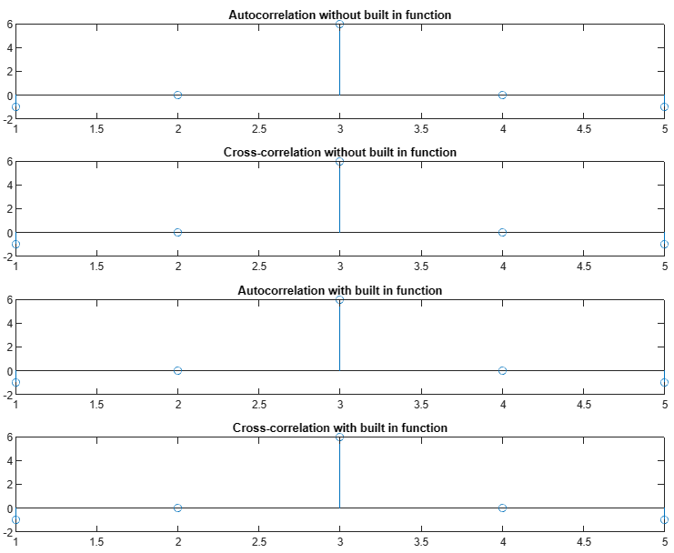

## Experiment No : 03

## Submission Date : May 15, 2023

## Experiment Name : Experimental study of Auto correlation and Cross correlation of signals using MATLAB.

---

## Theory:

<p style="text-align: justify">
In digital signal processing, autocorrelation is the correlation of a signal with a delayed copy of itself as a function of delay [1]. It is a measure of similarity between a signal and its time-delayed version [2]. The analysis of autocorrelation is a mathematical tool for finding repeating patterns, such as the presence of a periodic signal obscured by noise, or identifying the missing fundamental frequency in a signal implied by its harmonic frequencies [1]. It is often used in signal processing for analyzing functions or series of values, such as time domain signals [1].
</p>
<p style="text-align: justify">
In signal processing, cross-correlation is a measure of similarity of two series as a function of the displacement of one relative to the other [3]. This is also known as a sliding dot product or sliding inner-product [3]. It is commonly used for searching a long signal for a shorter, known feature [3]. It has applications in pattern recognition, single particle analysis, electron tomography, averaging, cryptanalysis, and neurophysiology [3].
</p>

## Code:

```matlab
% without built in functions

x = [-1 2 1];
N = length(x);

autocorr_x = zeros(1, 2*N-1);
for k = -N+1:N-1
    for n = 1:N
        if n+k >= 1 && n+k <= N
            autocorr_x(k+N) = autocorr_x(k+N) + x(n) * x(n+k);
        end
    end
end

crosscorr_xx = zeros(1, 2*N-1);
for k = -N+1:N-1
    for n = 1:N
        if n+k >= 1 && n+k <= N
            crosscorr_xx(k+N) = crosscorr_xx(k+N) + x(n) * x(n+k);
        end
    end
end

subplot(4,1,1)
stem(autocorr_x)
title('Autocorrelation without built in function')

subplot(4,1,2)
stem(crosscorr_xx)
title('Cross-correlation without built in function')

% With built in functions

auto_corr1 = xcorr(x);

cross_corr1 = xcorr(x,y);

subplot(4,1,3)
stem(auto_corr1)
title('Autocorrelation with built in function')

subplot(4,1,4)
stem(cross_corr1)
title('Cross-correlation with built in function')
```

## Output:



<br>

## Discussion and Conclusion:

<p style="text-align: justify">

Both of the with and without built in function code snippets were executed successfully and same results were obtained for each of the cases.

</p>

## References:

[1] “Autocorrelation,” Wikipedia. [Online]. Available: https://en.wikipedia.org/wiki/Autocorrelation. [Accessed: 11-May-2023].

[2] “What is Correlation in Signals and Systems,” Online Tutorials Library. [Online]. Available: https://www.tutorialspoint.com/what-is-correlation-in-signals-and-systems. [Accessed: 11-May-2023].

[3] “Cross-correlation,” Wikipedia. [Online]. Available: https://en.wikipedia.org/wiki/Cross-correlation. [Accessed: 11-May-2023].
