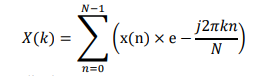
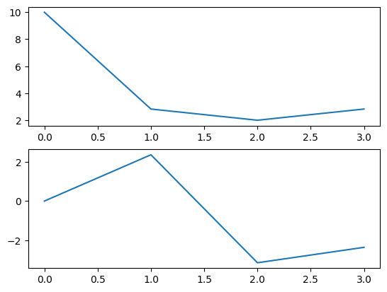

## Experiment No : 06

## Submission Date : June 18, 2023

## Experiment Name :

## Implementation of Discrete Time Fourier Transform

---

## Theory:

<p style="text-align: justify">
A discrete time fourier transform is a mathematical tool that can change a discrete sequence into its corresponding frequency domain representation and LTI discrete time system and create various computational algorithms. This tool is very useful computationally in convenient representation because it can handle both periodic and non-periodic sequences. The periodic sequences have to be sampled by making the period infinite. [1]

<p align="center">

</p>

<p style="text-align: justify">
Here, k = Frequency domain ordinal,
n = Time-domain ordinal,
N = Length of the sequence to be transformed.
</p>

## Code:

```python
import numpy as np
import matplotlib.pyplot as plt

def dft(x):
    N = len(x)
    X = np.zeros(N, dtype=np.complex_)
    for k in range(N):
        for n in range(N):
            X[k] += x[n] * np.exp(-1j * 2 * np.pi * k * n / N)
    return X


def main():
    N = 64
    x = [1,2,3,4]
    X = dft(x)

    plt.subplot(2, 1, 1)
    plt.plot(np.abs(X))
    plt.subplot(2, 1, 2)
    plt.plot(np.angle(X))
    plt.show()

if __name__ == '__main__':
    main()
```

## Output:

<p align="center">

</p>

## Discussion and Conclusion:

<p style="text-align: justify">
All the code is implemented in python language. The output was verified with the theory. No error was faced.
</p>

## References:

[1] “Discrete Fourier transform,” Wikipedia. [Online]. Available: https://en.wikipedia.org/wiki/Discrete_Fourier_transform. [Accessed: 16-June-2023].
